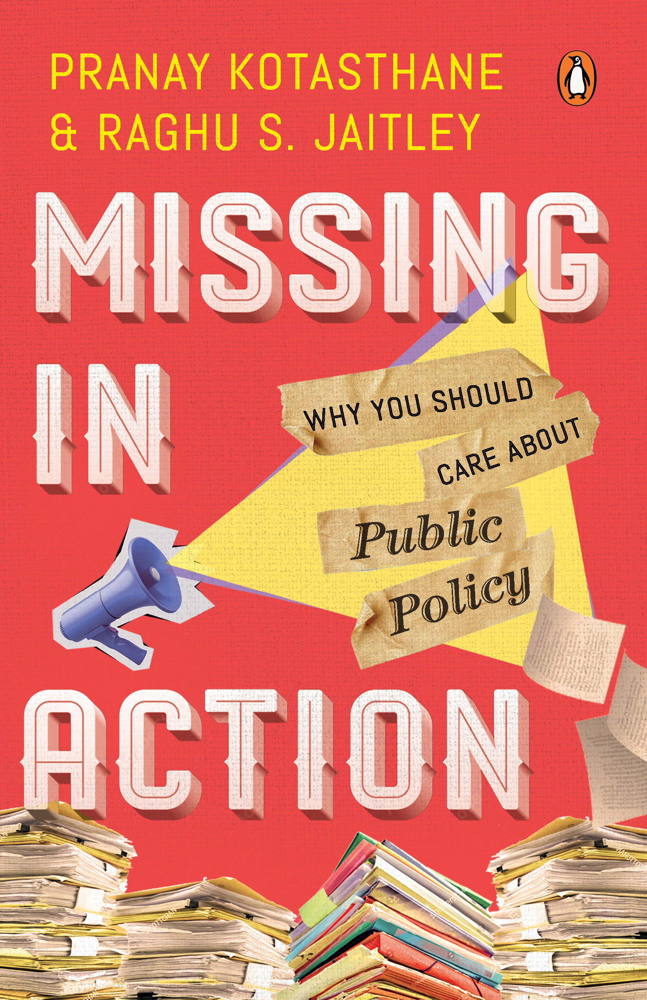
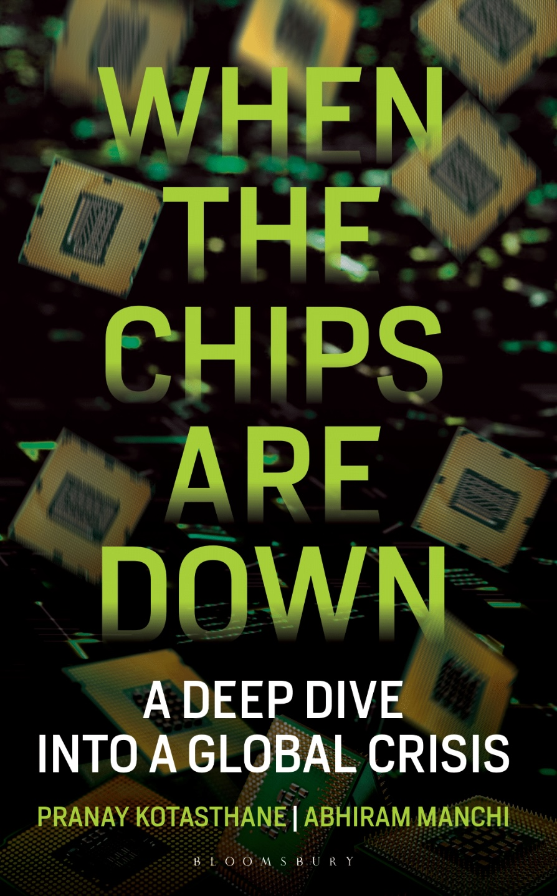
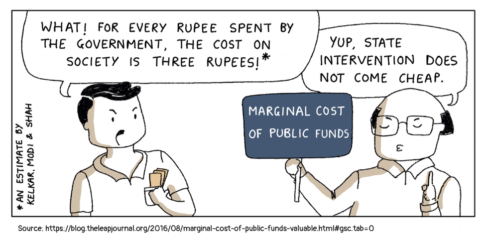

## Published Books

### Missing in Action: Why You Should Care About Public Policy

::: {.book-card}
::: {.grid}
::: {.g-col-3}
{.book-cover}
:::
::: {.g-col-9}
**Co-authored with:** Raghu S Jaitley

*Penguin Random House India, 2023*

At the heart of the book is our belief in the core objective of public policy. It should increase the welfare of the citizens. Like the verse from *Bhagavad Gita* goes:

अनन्याश्चिन्तयन्तो मां ये जनाः पर्युपासते।
तेषां नित्याभियुक्तानां योगक्षेमं वहाम्यहम्।।9.22।।

That word - *Yogakshema* - to preserve the prosperity and welfare of citizens is what public policy should be about.

We are hopeful about the future of India, but not in a misguided nationalistic way. We believe we can make an impact, however small, on the demand side of the policy equation. That making people aware of policy choices and helping them anticipate the unintended will lead to a change in the supply side of politics. There are two preconditions for this to happen, which we assume hold true. One, people have time and mental space available for discussions that matter to their lives. Two, a belief we can arrive at what's good for us through those debates and discussions.

In the book, we have taken the citizens as the point of reference and elaborated on their interactions with the state, the market and the society. Think of the book as a primer to understanding the fundamentals that underpin these interactions. We cover why we need a state or the markets, what is the role of society and how the three interplay among them. We go back to the foundational texts on political philosophy and economy in the book to explain the core concepts of public policy but in what we hope is an accessible fashion. We have tried to avoid jargon and approached all topics using first principles. Like the 16th century Bhakti poet, Nabha Dasa, who compiled the life of every saint from time immemorial in Bhaktamala, wrote:

*"Jaat na puchhie saadhu ki, poochh leejie gyan,*
*mol karo kirpan ka, padi rahne do mian"*

("Do not ask for the antecedents of a learned saint. Only seek their wisdom. The true worth is what's within us and not what you see from outside.")

We have been ecumenical in our approach in this book.

The other thing you might find interesting in the book is our focus on finding examples in the Indian context to illuminate a point or to make a case for our arguments. This will contextualise a lot of the discussions in the book to our immediate environment, and we hope it will make our reasoning clearer to our readers. Further, we have tried to keep ourselves free of dogma in the book. We have strong faith in markets, but we understand their limitations and the critical role of the state and society. We have been open to knowledge from all sources and have challenged our premises and priors before stating our point of view. Lastly, the tone of the book is conversational, and it is filled with some of our usual groan-inducing Bollywood references.

[Buy on Amazon →](https://www.amazon.in/Missing-Action-Should-Public-Policy/dp/0143459376/) | [Read excerpt →](https://publicpolicy.substack.com/i/155685209/india-policy-watch-a-republic-if-you-can-keep-it)
:::
:::
:::

---

### When the Chips Are Down: A Deep Dive into a Global Crisis

::: {.book-card}
::: {.grid}
::: {.g-col-3}
{.book-cover}
:::
::: {.g-col-9}
**Co-authored with:** Abhiram Manchi

*Bloomsbury, 2023*

To the world at large, technology was synonymous with software. But in 2019, the conversations changed dramatically. Today, the hardware that runs all software — semiconductors or chips — has become a subject of WhatsApp groups and international politics.

The chip shortage during COVID-19 made governments take notice of this complex supply chain. The US began denying advanced semiconductors to Chinese companies. Worsening China-Taiwan relations further intensified the debate. By 2022, China, the US, India, the EU, and Japan had released plans worth billions of dollars for setting up new semiconductor facilities.

This book is a comprehensive overview of this 'meta-critical' technology. How are semiconductors important from a geopolitical perspective? Why did the US and Taiwan become powerhouses in this domain while Russia and India fell behind? Is China's semiconductor sector a threat to the world? What are the future trends to watch out for? These are the questions this book answers.

[Buy on Amazon →](https://www.amazon.in/When-Chips-Down-Pranay-Kotasthane/dp/9356402469/)
:::
:::
:::

---

### We, The Citizens: Strengthening the Indian Republic

::: {.book-card}
::: {.grid}
::: {.g-col-3}
{.book-cover}
:::
::: {.g-col-9}
**Co-authored with:** Khyati Pathak and Anupam Manur

*Penguin Random House India, 2024*

What is a republic? How do markets work? What is the role of society in bringing about change? Many of us are unaware of what these entities stand for, how they interact with each other, and how they touch our lives.

*We, The Citizens* decodes public policy in the Indian context in a graphical narrative format relatable to readers of all ages. Whether you want to become an engaged citizen, aspire to be a positive change-maker, or wish to understand our sociopolitical environment, this book is for you.

The idea of India was an audacious dream. The fulfilment of this dream lies upon We, the citizens.

[Buy on Amazon →](https://www.amazon.in/We-Citizens-Strengthening-Indian-Republic/dp/0143463551)
:::
:::
:::

::: {.comic-panels}
**A peek inside — panels from the book:**

::: {layout-ncol=2}

:::
:::

---

## Upcoming

### Fiscal Fables

**Co-authored with:** Sarthak Pradhan

*Penguin Random House India, 2026*

There is an unending debate on the north-south claims on government money. Every election cycle unmistakably sees a discussion on freebies and corruption. The states and the union continue to have multiple disagreements concerning the Goods and Services Tax. And while Indian cities contribute to the bulk of its GDP, they are perennially begging for money. Finally, every few months, commentators advocate for raising taxes on the wealthy to alleviate income inequality.

Discussions around the topics listed above are now commonplace, yet they often take place in the absence of a grasp on public finance concepts, even though this discipline provides a framework to understand the role of a government in the economy. One probable reason is that public finance books written in India are academic and dry.

That’s where Fiscal Fables comes in. Our book demystifies India's public finances to a lay audience. It explains public finance concepts with the help of relatable stories and examples, to make this vital knowledge accessible to a general interest reader.

---

