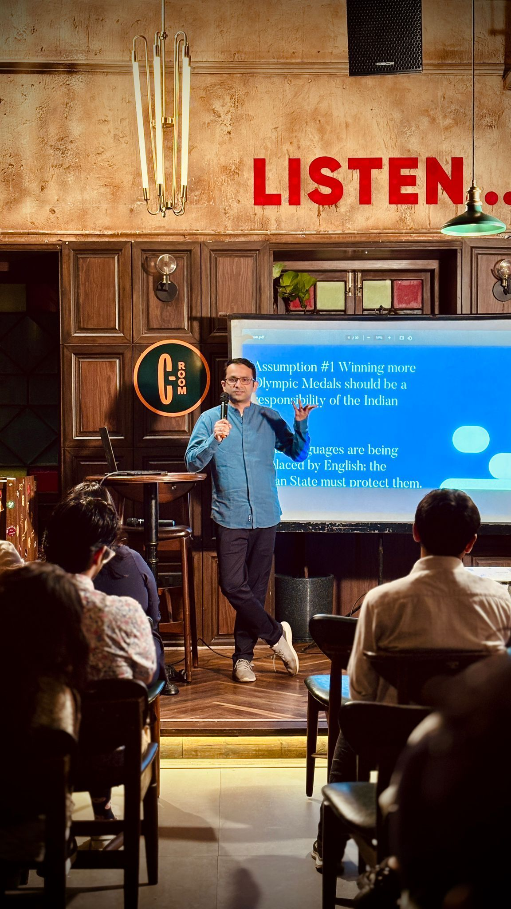
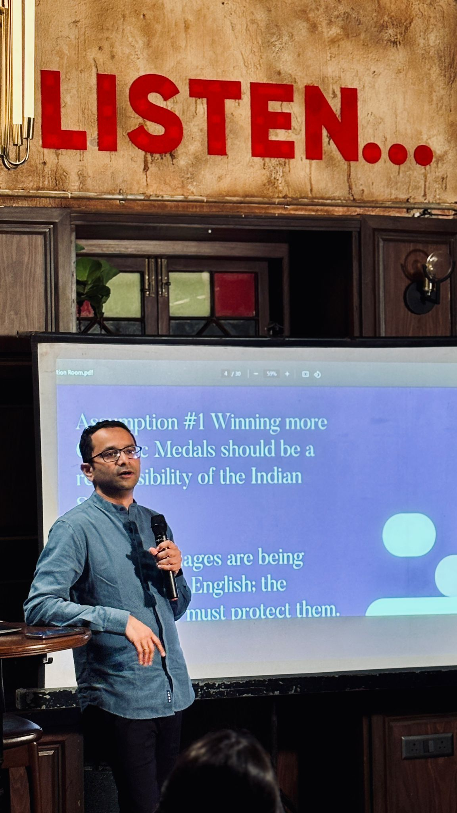

I try to open access to my slides from talks I have delivered on semiconductor geopolitics, public policy, technology strategy, and related topics. PDFs are hosted here for easy reference.

## Semiconductor Geopolitics

::: {.talk-card}
### India's Semiconductor Strategy: A Policy Overview

**Event:** CHIDIPLO Paris Policy Dialogue on *Semiconductor Industrial and Innovation Policy:What Works and What Does Not*

**Date:** February 11, 2026

Overview of India's semiconductor policy landscape, the India Semiconductor Mission, and the geopolitical context shaping chip supply chains.

[Download slides →](assets/slides/CHIPDIPLO-India.pdf){.btn .btn-primary target="_blank"}
:::

---

## Critical Minerals

::: {.talk-card}
### The Geopolitics of Critical Minerals
**Event:** A Talk at National Defence College, New Delhi
**Date:** March 10, 2026

I have given several versions of this talk, most recently being for the 66th cohort of India's top military institution for learning strategy, the National Defence College. In this talk, I explain the past, present, and future of mineral politics.

[Download slides →](assets/slides/NDC-2026.pdf){.btn .btn-primary target="_blank"}
:::

---

## Technology Geopolitics

::: {.talk-card}
### Geopolitics is Now a Business Problem
**Event:** [IMA India CEO Roundtable](https://www.imaindia.com/events/sessions/geopolitics-is-now-a-business-problem)
**Date:** June 2026

A fresh lecture for IMA India's CEO forum on why technology geopolitics has become a first-order business concern, and how firms should read the contest between the US, China, and middle powers.

[Download slides →](assets/slides/IMA-CEO-HTG.pdf){.btn .btn-primary target="_blank"}
:::

::: {.talk-card}
### High Tech Geopolitics: Trends, Misconceptions, and Creative Insecurity
**Event:** Lecture for the PGP-YL programme, Indian School of Business (ISB)
**Date:** June 2026

A variant of the high tech geopolitics deck, tailored for young leaders at ISB. Covers the means, goals, and fallouts of technology contestation, and the misconceptions that shape business and policy responses.

[Download slides →](assets/slides/ISB-htg.pdf){.btn .btn-primary target="_blank"}
:::

::: {.talk-card}
### High Tech Geopolitics: Trends & Assessments
**Event:** Lecture for PGP course at Indian Institute of Management, Bangalore
**Date:** February 17, 2026

The means, goals, and fallouts of technology contestation.

[Download slides →](assets/slides/IIMB-tech-geopolitics.pdf){.btn .btn-primary target="_blank"}
:::

---

## AI Geopolitics

:::{.talk-card}
### The Geopolitics of AI: Perspectives and Implications
**Event:** Lecture for the Takshashila GCPP Tech Policy course
**Date:** Every four months

This talk analyses the domains, instruments, and narratives of AI geopolitics.

[Download slides →](assets/slides/AIGeopolitics.pdf){.btn .btn-primary target="_blank"}

:::

---

## Public Finance & Fiscal Federalism

::: {.talk-card}
### The regressive nature of central transfers on health
**Event:** CEPPF, Patna
**Date:** December 7, 2018

Transfers are not linked to health indicators. Instead, such transfers by and large tend to be incremental. The specific purpose transfer system for health has not been very helpful in offsetting the fiscal disabilities of the poorer states. States tend to substitute grants received from the union for their own spending. Hence no commensurate increase in overall spending.
[Download slides →](assets/slides/central-transfers-health.pdf){.btn .btn-primary target="_blank"}
:::

---

## Public Policy

::: {.talk-card}
### Indian Society as a Change Maker
**Event:** Manthan, Hyderabad
**Date:** September 2020

Institutionally, there are three major actors in any community: the market, the State, and the civil society. However, in the state vs markets debate, we often forget that civil society itself can be a powerful actor for positive change. This is true especially in the Indian context where the ability of Indian society to correct itself has been underplayed, underestimated, and undermined by the Indian State. This talk makes a case for why certain tasks are best left for the Indian society to resolve. 

[Download slides →](assets/slides/Manthan-Societism.pdf){.btn .btn-primary target="_blank"}
:::

::: {.talk-card}
### Democracy, Constitution, and National Power
**Event:** Army War College, Mhow
**Date:** March 2026

In this lecture to select officers of the Indian armed forces, conducted as part of their training at the Army War College, I spoke about the Indian constitutional design. I discussed features of the Constitution that impinge on India's national power.

[Download slides →](assets/slides/AWC-2026_1.pdf){.btn .btn-primary target="_blank"}
:::

::: {.talk-card}
### Why is the Indian State Like This Only?
**Event:** ClassRoom @ The Conversation Room, Kolkata
**Date:** July 2025

This was my first talk at a bar. The setting was quite fun but instead of a stand-up, we were discussing public policy issues. In this talk, I explain the core features of the Indian State and why it behaves the way it does.

Here are some images from the talk. 

:::columns
:::column

:::

:::column

:::
:::

[Download slides →](assets/slides/ClassRoom-talk.pdf){.btn .btn-primary target="_blank"}
:::

---

## India Foreign Policy

::: {.talk-card}
### The Situation in the Strait of Hormuz and Its Potential Impact on India
**Event:** [Indian Danish Chamber of Commerce — Quarterly Seminar](https://app.glueup.com/event/idcc-quarterly-seminar-the-situation-in-the-strait-of-hormuz-and-its-potential-impact-on-india-182019/)
**Date:** June 2026

How disruption in the Strait of Hormuz would propagate to India through energy, trade, and remittance channels — and what India's resilience options look like across short, medium, and long horizons.

[Download slides →](assets/slides/india_resilience_idcc--2-.pdf){.btn .btn-primary target="_blank"}
:::

